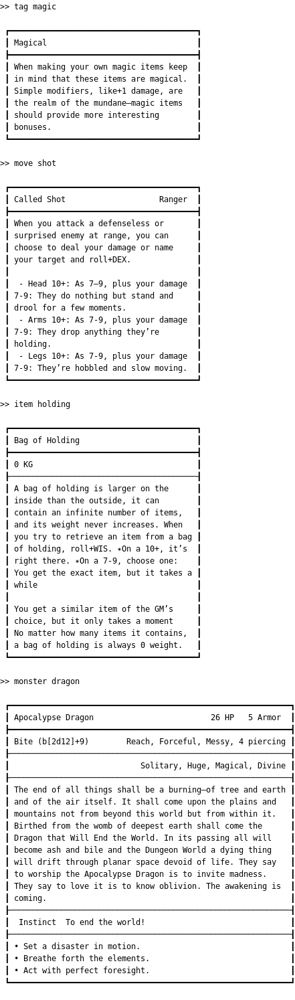

<p align="center">
  
  <h3>Console-Hero</h3>
</p>

Your [Dungeon World](http://www.dungeon-world.com/) command line tool.
Has autocompletion and history, thanks to [rustyline](https://github.com/kkawakam/rustyline) and [clap](https://clap.rs/).
The data used in this project comes from the [DungeonWorldData](https://github.com/Vindexus/DungeonWorldData) project.

## Overview
- *Query*
  - monsters: `monster dragon`
  - items: `item bag`
  - tags: `tag ammo`
  - moves: `move help`
- *Roll* dice: `roll 2d4+19`
- *List* matching stuff: `list drag`

## Build

Build and execute with `cargo run --release`.

## Usage

Asking `console-hero` for help:
```
> cargo run -- help

USAGE:
    console-hero [FLAGS] [OPTIONS] [SUBCOMMAND]

FLAGS:
    -h, --help           Prints help information
    -I, --interactive    Enter interactive mode (default, if no subcommand is given)
    -V, --version        Prints version information

OPTIONS:
    -i, --item_data <FILE>       Specify a custom item data file [default: data/items.json]
    -m, --monster_data <FILE>    Specify a custom monster data file [default: data/monsters.json]
    -o, --move_data <FILE>       Specify a custom move data file [default: data/moves.json]
    -t, --tag_data <FILE>        Specify a custom tag data file [default: data/tags.json]

SUBCOMMANDS:
    help       Prints this message or the help of the given subcommand(s)
    item       Find the first item matching the given regex
    list       List all items of the given category matching the optional REGEX
    monster    Find the first monster matching the given regex
    move       Find the first move matching the given regex
    roll       Roll a die using a d20 expression
    tag        Find the first tag matching the given regex
```

Using the `help` command from within the interactive mode:
```
>> help

COMMANDS:
    help | info       Print this usage information
    quit              Exit interactive mode
    item REGEX        Find the first item matching the given REGEX
    monster REGEX     Find the first monster matching the given REGEX
    move REGEX        Find the first move matching the given REGEX
    tag REGEX         Find the first tag matching the given REGEX
```

## Example
The image misses some colors, but they already work!



### List stuff
```
> console-hero list tags n
>> Tags
   n ammo
   +n armor
   +bonus
   n coins
   +n damage
   dangerous
   hand
   ignores armor
   near
   n piercing
   ration
   stun
   thrown
   two-handed
   n uses
   n weight
   worn

> console-hero list monsters dragon
>> Monsters
   Apocalypse Dragon
   Dragon
   Dragon Turtle
   Dragon Whelp
   Dragonbone

> console-hero list dr
>> Monsters
   Apocalypse Dragon
   Dragon
   Dragon Turtle
   Dragon Whelp
   Dragonbone
   Draugr
   Dryad
   Formian Drone
   Hydra
>> Moves
   Eldritch Chord
   Eldritch Tome
   The Druid Sleep
>> Items
>> Tags

```

## TODO

- [x] Add moves from [moves.json](data/moves.json)
- [x] Add monsters from [monsters.json](data/monsters.json)
- [x] ~~Add missing moves from [special_moves.json](data/special_moves.json) and [basic_moves.json](data/basic_moves.json)~~ Not relevant.
- [x] Add tags from [tags.json](data/tags.json)
- [ ] Add classes from [classes.json](data/classes.json)
- [x] Add items from [items.json](data/items.json)
- [ ] Add spells
- [x] Complete completion (commands, ...)
- [x] Add option to evaluate commands non-interactively
- [x] Add help command `--help`/`help`
- [x] Unify formatting
- [x] Add option to list stuff (`list monster 'dragon'`)
- [ ] Add tests
- [ ] Think of a way to handle the characters
- [x] Add a dice already, will you?!
- [ ] Expose a nicer API.
- [ ] Make colors optional. Add a feature and `--colors always | never` option.
- [ ] Use an intuitive but powerful language in interactive mode:
  - [ ] Add quantifiers for all sort of things like `all items bag` to list all items containing the regex bag.
        `any` is already the default but one should be able to make it explicit.
  - [ ] Add option to explain all attributes of a thing.
        Something like `tags of ...` to list tags from `...` with description.
- [ ] Add the option to create things both interactively and non-interactively.
  - [ ] Add serialization for the data
  - [ ] Add item creation
  - [ ] Add monster creation
  - [ ] Add tag creation
  - [ ] Add move creation
  - [ ] Add character creation

---

Thanks to the creators of Dungeon World!
