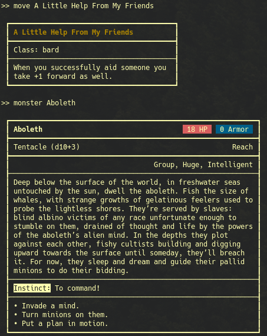

# Console-Hero

A [Dungeon World](http://www.dungeon-world.com/) command line helper. As of yet only supports querying moves. But has autocompletion and history, thanks to [rustyline](https://github.com/kkawakam/rustyline).
The data used in this project comes from the [DungeonWorldData](https://github.com/Vindexus/DungeonWorldData) project.

## Usage

Build and execute with `cargo run --release`.

## Example

## TODO

- [x] Add moves from [moves.json](data/moves.json)
- [x] Add monsters from [monsters.json](data/monsters.json)
- [ ] Add missing moves from [special_moves.json](data/special_moves.json) and [basic_moves.json](data/basic_moves.json)
- [ ] Add tags from [tags.json](data/tags.json)
- [ ] Add classes from [classes.json](data/classes.json)
- [ ] Add equipment from [equipment.json](data/equipment.json)
- [ ] Complete completion (commands, ...)
- [ ] Add option to evaluate commands non-interactively
- [ ] Add help command `--help`/`help`
- [ ] Unify formatting
- [ ] Add tests
- [ ] Add option to explain all attributes of a thing.
      Something like `tags of ...` to list tags from `...` with description.I

Thanks to the creators of Dungeon World!
